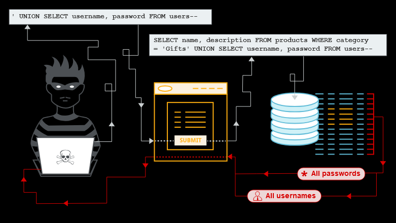
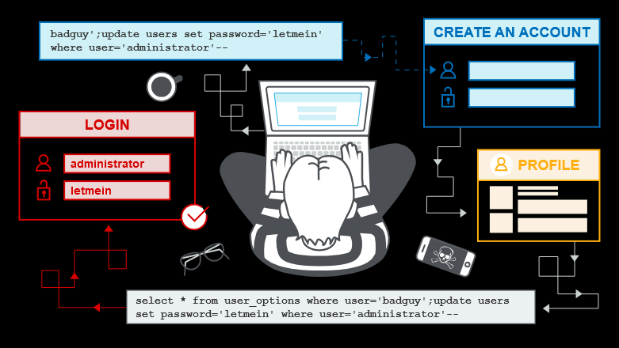

# SQL injection

## Topics to cover

1. What SQL injection (SQLi) is.
2. How to find and exploit different types of SQLi vulnerabilities.
3. How to prevent SQLi.

## Demonstration



## Overview

> SQL injection (SQLi) is a web security vulnerability that allows an attacker to interfere with the queries that an application makes to its database.  
> In some situations, an attacker can escalate a SQL injection attack to compromise the underlying server or other back-end infrastructure. It can also enable them to perform denial-of-service attacks.  

## Impact

A successful SQL injection attack can result in unauthorized access to sensitive data, such as:

1. Passwords.
2. Credit card details.
3. Personal user information.

## How to detect

1. The single quote character ' and look for errors or other anomalies.
2. Some SQL-specific syntax that evaluates to the base (original) value of the entry point, and to a different value, and look for systematic differences in the application responses.
3. Boolean conditions such as OR 1=1 and OR 1=2, and look for differences in the application's responses.
4. Payloads designed to trigger time delays when executed within a SQL query, and look for differences in the time taken to respond.
5. OAST payloads designed to trigger an out-of-band network interaction when executed within a SQL query, and monitor any resulting interactions.  

You can also use payload from [PayloadsAllTheThings](https://github.com/swisskyrepo/PayloadsAllTheThings/tree/master/SQL%20Injection) 

# Blind SQL injection

## Overview

Many instances of SQL injection are blind vulnerabilities. This means that the application does not return the results of the SQL query or the details of any database errors within its responses.  
Blind vulnerabilities can still be exploited to access unauthorized data, but the techniques involved are generally more complicated and difficult to perform. 

## How to exploit

1. You can change the logic of the query to trigger a detectable difference in the application's response depending on the truth of a single condition. This might involve injecting a new condition into some Boolean logic, or conditionally triggering an error such as a divide-by-zero.
2. You can conditionally trigger a time delay in the processing of the query. This enables you to infer the truth of the condition based on the time that the application takes to respond.
3. You can trigger an out-of-band network interaction, using OAST techniques. This technique is extremely powerful and works in situations where the other techniques do not. Often, you can directly exfiltrate data via the out-of-band channel. For example, you can place the data into a DNS lookup for a domain that you control.

# Second-order SQL injection

## Overview

First-order SQL injection occurs when the application processes user input from an HTTP request and incorporates the input into a SQL query in an unsafe way.

Second-order SQL injection occurs when the application takes user input from an HTTP request and stores it for future use.  
This is usually done by placing the input into a database, but no vulnerability occurs at the point where the data is stored. Later, when handling a different HTTP request, the application retrieves the stored data and incorporates it into a SQL query in an unsafe way. For this reason, second-order SQL injection is also known as stored SQL injection. 



# SQL injection in different contexts

You can perform SQL injection attacks using any controllable input that is processed as a SQL query by the application. For example, some websites take input in JSON or XML format and use this to query the database.  

For example, the following XML-based SQL injection uses an XML escape sequence to encode the S character in SELECT:
```
<stockCheck>
    <productId>123</productId>
    <storeId>999 &#x53;ELECT * FROM information_schema.tables</storeId>
</stockCheck>
```

## Prevention

1. You can prevent most instances of SQL injection using parameterized queries/prepared statements instead of string concatenation within the query.

Vulnerable code:
```
String query = "SELECT * FROM products WHERE category = '"+ input + "'";
Statement statement = connection.createStatement();
ResultSet resultSet = statement.executeQuery(query);
```

Prevented code:
```
PreparedStatement statement = connection.prepareStatement("SELECT * FROM products WHERE category = ?");
statement.setString(1, input);
ResultSet resultSet = statement.executeQuery();
```

Application functionality that places untrusted data into some parts of the query needs to take a different approach, such as:

* Whitelisting permitted input values.
* Using different logic to deliver the required behavior.

## Additional Reading

[Find SQL injection vulnerabilities using Burp Suite's web vulnerability scanner](https://portswigger.net/burp/vulnerability-scanner)

## Labs solved

1. [SQL injection vulnerability in WHERE clause allowing retrieval of hidden data](https://portswigger.net/web-security/sql-injection/lab-retrieve-hidden-data) - [Solution](labs/lab1.MD)  
2. [SQL injection vulnerability allowing login bypass](https://portswigger.net/web-security/sql-injection/lab-login-bypass) - [Solution](labs/lab2.MD)
3. [SQL injection attack, querying the database type and version on Oracle](https://portswigger.net/web-security/sql-injection/examining-the-database/lab-querying-database-version-oracle) - [Solution](labs/lab3.MD)
4. [SQL injection attack, querying the database type and version on MySQL and Microsoft](https://portswigger.net/web-security/sql-injection/examining-the-database/lab-querying-database-version-mysql-microsoft) - [Solution](labs/lab4.MD)
5. [SQL injection attack, listing the database contents on non-Oracle databases](https://portswigger.net/web-security/sql-injection/examining-the-database/lab-listing-database-contents-non-oracle) - [Solution](labs/lab5.MD)
6. [SQL injection with filter bypass via XML encoding](https://portswigger.net/web-security/sql-injection/lab-sql-injection-with-filter-bypass-via-xml-encoding) - [Solution](labs/lab6.MD)
7. [SQL injection attack, listing the database contents on Oracle](https://portswigger.net/web-security/sql-injection/examining-the-database/lab-listing-database-contents-oracle) - [Solution](labs/lab7.MD)  
8. [SQL injection UNION attack, determining the number of columns returned by the query](https://portswigger.net/web-security/sql-injection/union-attacks/lab-determine-number-of-columns) - [Solution](labs/lab8.MD)
9. [SQL injection UNION attack, finding a column containing text](https://portswigger.net/web-security/sql-injection/union-attacks/lab-find-column-containing-text) - [Solution](labs/lab9.MD)
10. [SQL injection UNION attack, retrieving multiple values in a single column](https://portswigger.net/web-security/sql-injection/union-attacks/lab-retrieve-multiple-values-in-single-column) - [Solution](labs/lab10.MD)
11. [Blind SQL injection with conditional responses](https://portswigger.net/web-security/sql-injection/blind/lab-conditional-responses) - [Solution](lab11.MD)
12. 


