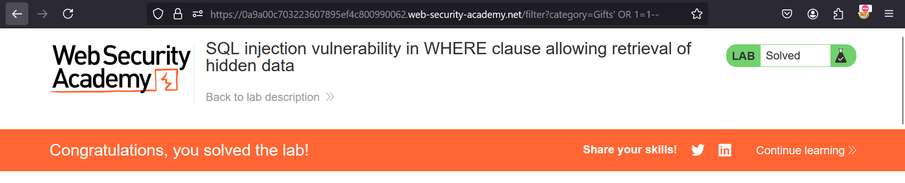

**SQL injection vulnerability in WHERE clause allowing retrieval of hidden data**

 This lab contains a SQL injection vulnerability in the product category filter. When the user selects a category, the application carries out a SQL query like the following:

```
SELECT * FROM products WHERE category = 'Gifts' AND released = 1
```

To solve the lab, perform a SQL injection attack that causes the application to display one or more unreleased products. 


Solution:-

* Just simply open the Lab portal
* Click on any category
* You'll observe ```/filter?category=``` appended in the search box.
* Just a simple payload will work here. 
* Add ``` ' OR 1=1--``` at the end & you'll end up solving the lab



