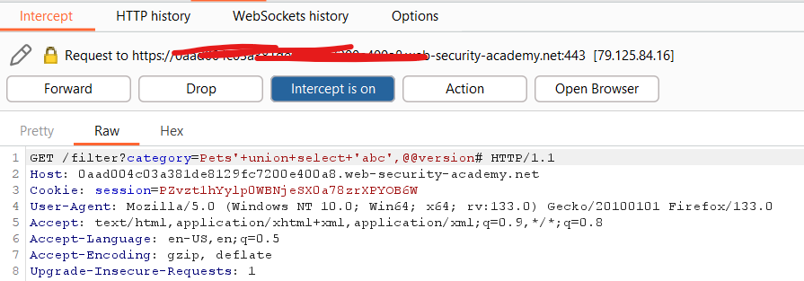
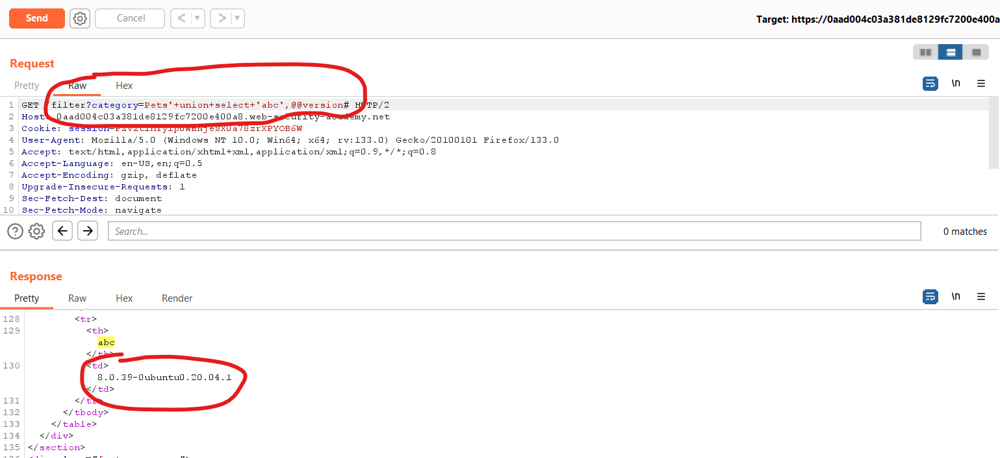
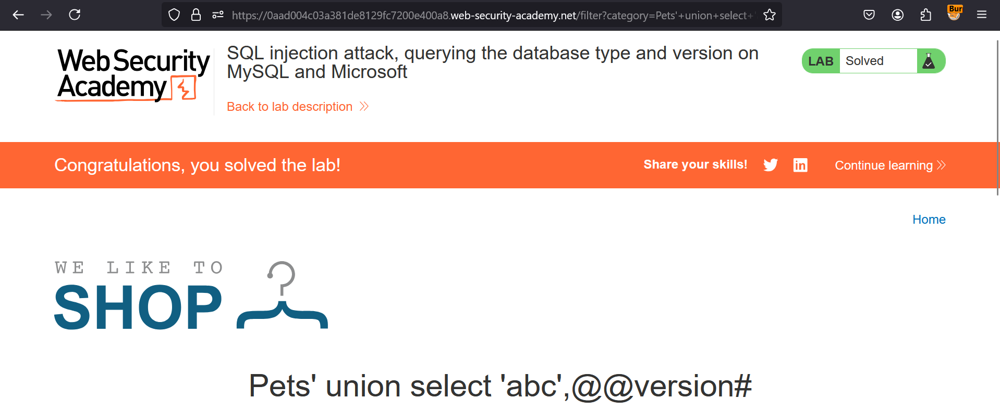

**SQL injection attack, querying the database type and version on MySQL and Microsoft**

This lab contains a SQL injection vulnerability in the product category filter. You can use a UNION attack to retrieve the results from an injected query.

To solve the lab, display the database version string. 

Solution:-

* Ok, now open the vulnerable portal provided
* Check any category & add ```'ORDER BY 1#``` for checking total columns in the DB
* Increase the no till you get Internal Server Error. Till when you won't get it, is the total no of columns.
* In our case, it's 2. So, total columns is 2. Now, we need to use it to find DB version  
* In DB, for version, we've @@version, put that with column names as any other string. So, our query becomes: ```'union+select+'abc',@@version#```
* Add it at then end of search bar & press ENTER.
* Congrats, you solved the lab !!

NOTE: In case it's not solved via above method, you can try using BurpSuite tool for this.

Step 1: Turn on Intercept in BurpSuit
Step 2: Now, select category & forward all requests under Proxy tab
Step 3: Now, forward that request to Repeater by right click >> Send to Repeater & changing the request string to ```'union+select+'abc',@@version#```

Step 4: Click send & search for abc string, below that, you'll see linux version printed

Congrats, now you need to right click & click on Show response in browser & copy paste the link in browser to solve the lab successfully.  


