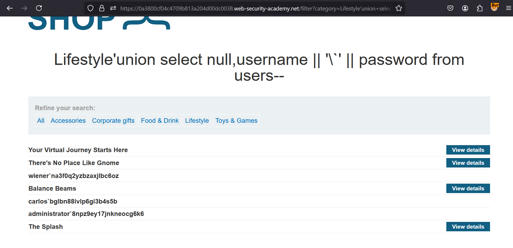

**SQL injection UNION attack, retrieving multiple values in a single column**

 This lab contains a SQL injection vulnerability in the product category filter. The results from the query are returned in the application's response so you can use a UNION attack to retrieve data from other tables.

The database contains a different table called users, with columns called username and password.

To solve the lab, perform a SQL injection UNION attack that retrieves all usernames and passwords, and use the information to log in as the administrator user. 

Solution:-

         
* Navigate to the portal & turn on intercept in BurpSuite
* Now, go to any category & check it in Burpsuite's Proxy tab
* Then, Send this to repeater & turn off the intercept
* Now, we need to go step by step to check version of database
     1. Find no of columns
     2. Find datatype of the columns
     3. Version of the database
     4. Output the user credentials for admin in single line in database
    
* So, in order to find no of columns, add ```' ORDER BY 1--``` & increase it till we get Internal Server Error  
* Now, we know no of columns as 2, Add ```'UNION SELECT NULL, 'b'--``` to see it accepts string type or not. It does, in our case  
* Now, as we don't know the database, we need to check both Microsoft & PostGreSQL. For that, check with ```' UNION SELECT @@version, NULL--``` & ```' UNION SELECT version(), NULL--```, out of which later is giving 200 OK response.
* Now, we need to output out list of table names in DB, for that add ```UNION SELECT table_name, NULL from information_schema.tables--```
* & you'll now have table name - users, we now have column names username & password.
* Now, we need user credentials. For that, write ```'union+select+null,username+||+'`'+||+password+from+users--```
* Now, you'll get output with **username** & **password** for admin seperated with ~.  




[Direct Solution Link](https://0a3800cf04c4709b813a204d00dc0038.web-security-academy.net/filter?category=Lifestyle%27union+select+null,username+||+%27`%27+||+password+from+users--)

