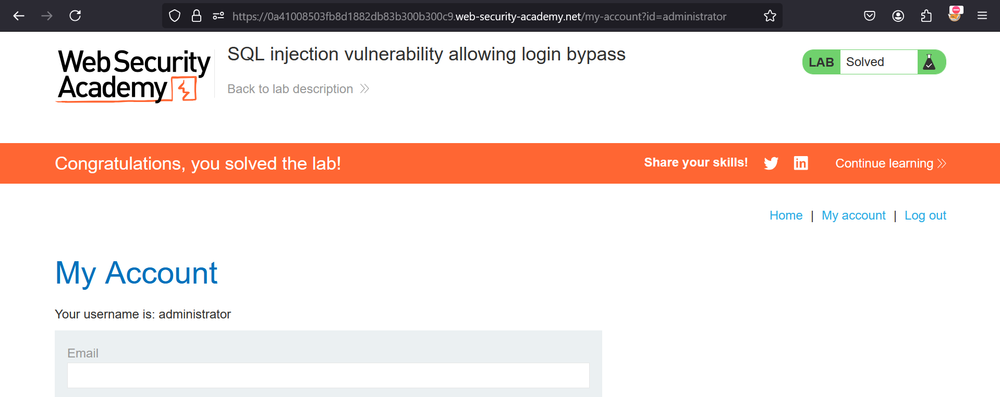

**SQL injection vulnerability allowing login bypass**

This lab contains a SQL injection vulnerability in the login function.

To solve the lab, perform a SQL injection attack that logs in to the application as the _administrator_ user. 

Solution:-

* In order to check SQL Injection, first cross verify it.
* Provide username as ```administrator'``` & password as ```admin```
* If you get Internal server error, double check with ```admin'``` & ```admin```
* Now, if you get Internal Server Error both the times, you can go ahead with username as ```administrator' --``` & password as anything random
* We've tried bypassing password field with ```--``` as in SQL language, comments are denoted with -- only
* This solves our 2nd lab, Congratulations !!



