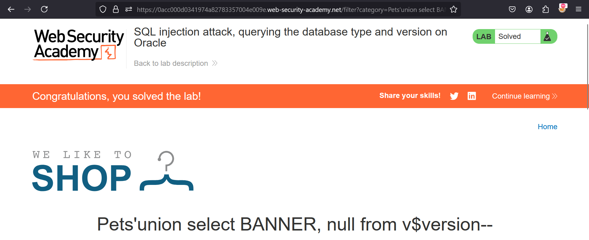

**SQL injection attack, querying the database type and version on Oracle**

This lab contains a SQL injection vulnerability in the product category filter. You can use a UNION attack to retrieve the results from an injected query.

To solve the lab, display the database version string. 

Solution:-

* Ok, now open the vulnerable portal provided
* Check any category & add ```'ORDER BY 1--``` for checking total columns in the DB
* Increase the no till you get Internal Server Error. Till when you won't get it, is the total no of columns.
* In our case, it's 2. So, total columns is 2. Now, we need to use it to find DB version  
* In Oracle, DUAL is a table automatically created by Oracle Database along with the data dictionary. DUAL is in the schema of the user SYS but is accessible by the name DUAL to all users. It has one column, DUMMY, defined to be VARCHAR2(1) , and contains one row with a value X.  
* The banner displays the database release and version number. The ID of the container to which the data pertains. Possible values include 0 : This value is used for rows containing data that pertain to the entire CDB.  
* In DB, for version, we've v$version table, put that with column names as banner & null. So, our query becomes: ```'union select BANNER, null from v$version--```
* Add it at then end of search bar & press ENTER.
* Congrats, you solved the lab !!


