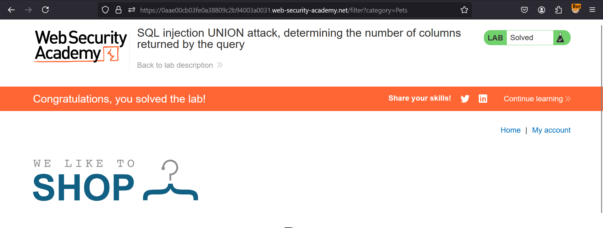

**SQL injection UNION attack, determining the number of columns returned by the query**

 This lab contains a SQL injection vulnerability in the product category filter. The results from the query are returned in the application's response, so you can use a UNION attack to retrieve data from other tables. The first step of such an attack is to determine the number of columns that are being returned by the query. You will then use this technique in subsequent labs to construct the full attack.

To solve the lab, determine the number of columns returned by the query by performing a SQL injection UNION attack that returns an additional row containing null values. 

Solution:- 


* Navigate to the portal & turn on intercept in BurpSuite
* Now, go to any category & check it in Burpsuite's Proxy tab
* Then, Send this to repeater & turn off the intercept
* Now, we need to go step by step to check version of database
     1. Find no of columns
    
* So, in order to find no of columns, add ```' ORDER BY 1--``` & increase it till we get Internal Server Error  
* Now, we know no of columns as 3, Add ```'UNION SELECT NULL,'A',NULL--``` to see it accepts string type or not. It does, in our case  
* Total columns: 3
* Congratulations, you solved the lab

