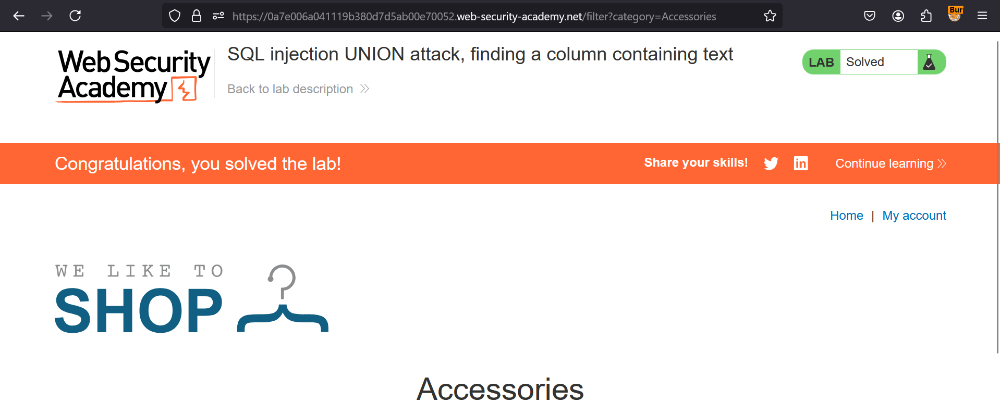

**SQL injection UNION attack, finding a column containing text**

This lab contains a SQL injection vulnerability in the product category filter. The results from the query are returned in the application's response, so you can use a UNION attack to retrieve data from other tables. To construct such an attack, you first need to determine the number of columns returned by the query. You can do this using a technique you learned in a previous lab. The next step is to identify a column that is compatible with string data.

The lab will provide a random value that you need to make appear within the query results. To solve the lab, perform a SQL injection UNION attack that returns an additional row containing the value provided. This technique helps you determine which columns are compatible with string data. 

Solution:- 

* Navigate to the portal & turn on intercept in BurpSuite
* Now, go to any category & check it in Burpsuite's Proxy tab
* Then, Send this to repeater & turn off the intercept
* Now, we need to go step by step to check version of database
     1. Find no of columns
    
* So, in order to find no of columns, add ```' ORDER BY 1--``` & increase it till we get Internal Server Error  
* Now, we know no of columns as 3, Add ```'UNION SELECT NULL,'A',NULL--``` to see it accepts string type or not. It does, in our case  
* The column with text input is 2nd one
* Now, just replace the string with the given string in vulnerable website. Mine was JoT8YX, so I've just used the payload ```'union+select+null,'JoT8YX',null--```
* Congratulations, you solved the lab

